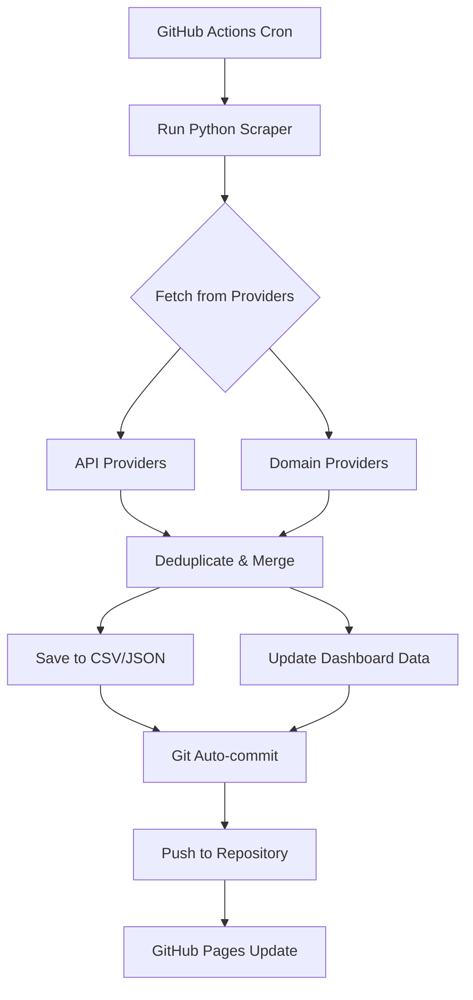

# 📧 TempMail Harvester


> 🤖 An automated system that harvests temporary/disposable email addresses from 220+ providers every 24 hours using GitHub Actions.

## 🎯 Features

- ✅ **220+ Providers** — Harvests from API-based and domain-based providers
- ✅ **Fully Automated** — Runs daily via GitHub Actions cron job
- ✅ **Auto-Commit** — Results auto-committed back to repository
- ✅ **Dashboard** — Beautiful static website via GitHub Pages
- ✅ **Dual Format** — Data saved in both CSV and JSON
- ✅ **100% Free** — No paid APIs, no paid services
- ✅ **Deduplication** — Smart merging prevents duplicate entries

## 📁 Project Structure

```text
.
├── .github/
│   └── workflows/
│       └── harvest.yml        # GitHub Actions workflow
├── dashboard/
│   ├── index.html             # Static dashboard
│   └── data.json              # Dashboard data
├── data/
│   ├── emails.csv             # Harvested emails (CSV)
│   └── emails.json            # Harvested emails (JSON)
├── scraper/
│   ├── __init__.py
│   └── main.py                # Main scraping logic
├── config.py                  # Project configuration
├── requirements.txt           # Python dependencies
└── README.md                  # This file
```

## 🚀 Quick Start

### Local Development
```bash
git clone https://github.com/YOUR_USERNAME/fake-email-finder-and-checker.git
cd fake-email-finder-and-checker
pip install -r requirements.txt
python -m scraper.main
```

### GitHub Actions (Automated)
1. Fork this repository
2. Go to Settings → Actions → General → Allow all actions
3. The harvester runs automatically every day at 2 AM UTC
4. Or trigger manually: Actions → TempMail Harvester → Run workflow

### GitHub Pages Dashboard
1. Go to Settings → Pages
2. Source: Deploy from a branch
3. Branch: main, Folder: /dashboard
4. Your dashboard will be live at: `https://YOUR_USERNAME.github.io/fake-email-finder-and-checker/`

## 📊 How It Works



## 🔧 Configuration

Edit `config.py` to customize:
- Request timeout
- Concurrent workers
- Output paths

## ⚠️ Disclaimer

This project is for educational and research purposes only. The collected email addresses are publicly available temporary/disposable emails. Do not use this tool for spam, harassment, or any illegal activities.

## 📄 License

MIT License - see LICENSE for details.
